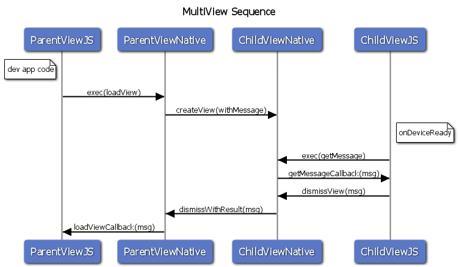

# phonegap-plugin-multiview

This plugin allows your PhoneGap app to create multiple views.

[Here is a video](https://youtu.be/WVbxFIGBh0Y) showing the demo project running in the ios simulator.

Each view:
===

- has it's own global context
- has it's own collection of plugins (instances, classes are shared, so watch for statics )
- can communicate via localStorage ( assuming they are loaded from the same location )
-has access to all Cordova resources

Currently Supported Platforms:
===

- iOS
- Android

This project includes a brief demo project, to run it in ios/Android:
===

    cd demo
    cordova platform add ios (or) cordova platform add android
    cordova plugin add --link .. (Android does not link)
    cordova run ios (or) cordova run android

The current API supports two views but will eventually have support for multiple views in a stack.

 Quickstart Guide to using the MultiView plugin on the Android Platform
 ===

 - To *launch* a new webview make this call in your application's JS:
  PGMultiView.loadView(url, message, success, error);

      @param 'url' the location of your html file.  The multiview plugin automatically adds the
      prefix of :///android_asset/www/ if your url does not start with js
      @param  'message', current version stores data in the form of string.  In the next release 'message' will require JSON objects.
      @param 'success', a sucessful plugin callback
      @param 'error', the plugin was not called

      -please note that you must make two separate JS files which correspond respectively to the native portions of the plugin
      (PGMultiview.java and PGMultiviewActivity.java) if you want to utilize both views.

 - To *dismiss* a webview make this call in your application's JS:
      PGMultiView.dismissView(data);
      @param 'data' is currently a string - will be JSON object in next release.

 - Passing Data

      - when the action dismissView() is called in your app's JS, the onQuit() function is executed
      in the corresponding native (parent) PGMultiview.java file

      - startCordovaActivity(url, message)
        The child view is activated.  Data and a plugin result are passed to the plugin which updates the childview.
        @param 'url', passed in from 'execute', this is the location of the html for the child activity
        @param 'Message to Child', data to be sent from the parent (PGMultiView.java) to the child(PGMultiviewActivity.java)

      - onActivityResult(requestCode, resultCode, intent )
        - 'requestCode', an integer which is unpacked by the parent view from the intent passed by the childview
        - 'result code', an arbitrary integer set in the parent view
        > When the childview has been backgrounded (aka user navigates away from the PGMultiviewActivity.java) the parent view retrieves
        the result of that activity ,"message from parent", and requestCode from the intent

      - onQuit()
        During onQuit() the plugin is notified that the child view is being backgrounded.
        Data and an identifying key are packaged into an intent and sent to the parent view

- Persisting Data

      - Currently data is stored to memory (not disc).  Under most operating conditions this should not be an issue.
       However, in an extreme low memory state you do risk losing data between views if either PGMultiView.java or or PGMultiViewActivity crash before reaching onStop() in the activity lifecycle.
      - This should be resolved in the near future, the next release of this plugin bindsEvents() and writes the saved view state to local storage so that it can be retrieved at OnPause() in the Cordova Activities' lifecycle.

ios:
===

Open a new view:
====

    PGMultiView.loadView(srcUrl);

And remove it:
====

    PGMultiView.dismissView();

